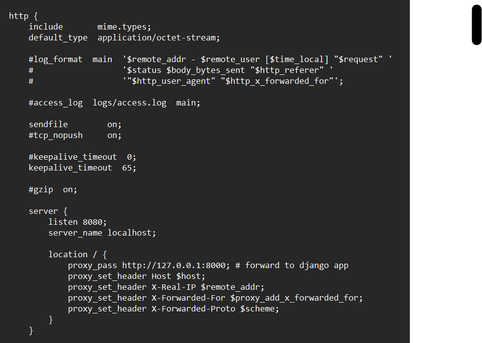

# Software-engineering

Morning Sunshine!
The world says: "Hello!"

Installation process fr:

- get nginx downloaded on ur machine
- test if the nginx web server is running by accessing "localhost" in your browser
- open up terminal and go to the location of the nginx.conf file
- write the server section in the http{} block as shown in the image below:

- access the website by going to the following address "localhost:8080"
- side note: install python packages if any errors are being encountered ;)